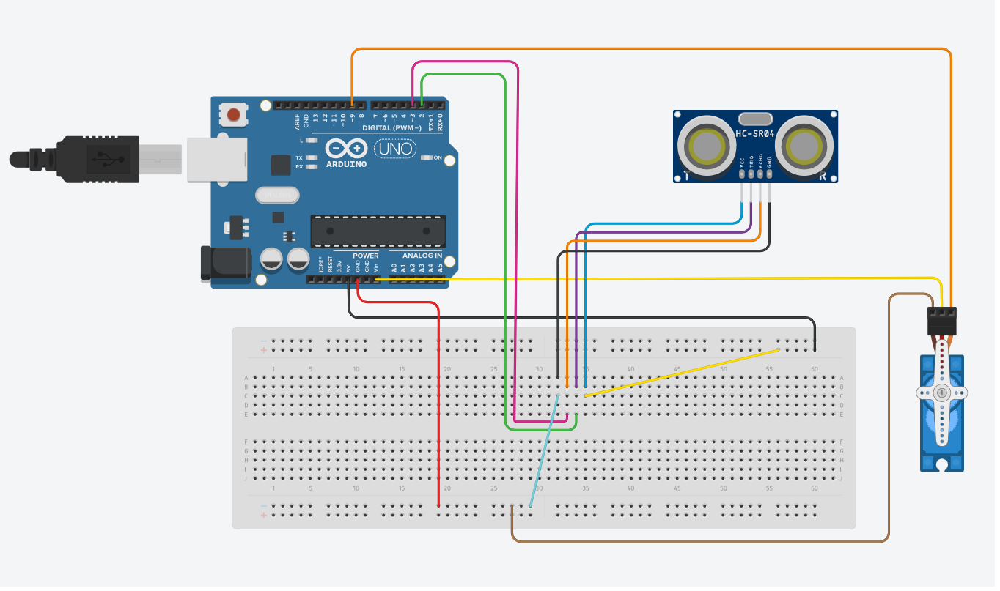

# Arduino Ultrasonic Radar

A simple micro servo-mounted ultrasonic radar that sweeps in an 180° arc and visualizes distance readings in a radar display.

## How it works
- The Arduino sweeps the SG90 micro servo from 0° to 180° and back.
- The servo-mounted HC-SR04 sensor takes an ultrasonic distance reading at each step.
- The reading is sent over serial in the format `angle,distance`.
- The Pygame visualizer reads the serial using PySerial and visualizes it in the radar display.

## Hardware
- 1x Arduino Uno R3
- 1x HC-SR04 ultrasonic distance sensor
- 1x SG90 Micro servo motor
- 1x Breadboard
- Jumper wires

## Wiring
| Component | Pin |
|-----------|-----|
| HC-SR04 Trig | D2 |
| HC-SR04 Echo | D3 |
| Servo signal | D9 |
| Servo PWR | VIN |

> **Warning**: The servo is powered from VIN instead of the 5V pin because USB power cannot supply sufficient current for the servo through the 5V rail. When the Arduino is powered via USB, VIN sits at approximately 4.8V which is acceptable for the servo. Do not use a barrel jack adapter with this wiring as VIN will carry the full input voltage (7-12V) which will damage the servo.

## Schematic
Designed and simulated in [Tinkercad](https://www.tinkercad.com/).

